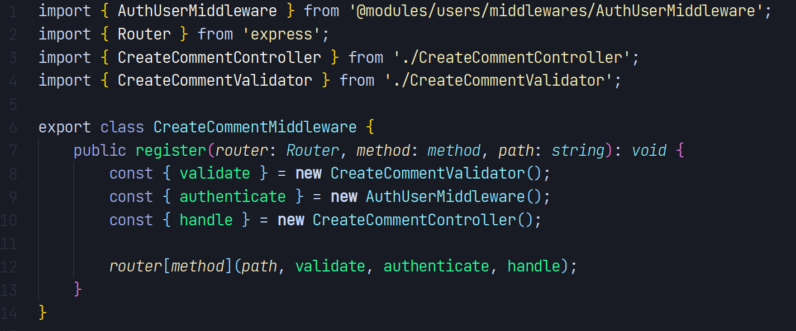

# Api Backend Tindin


## Sobre

> API em NodeJS, utilizando banco de dados MongoDB (TypeORM), com cobertura de testes (coverages), utilizando o Jest.<br /> 👉 <a href="http://143.198.112.106:3011/classes"> app url</a>

## Paths

### Login do user

👉 http://143.198.112.106:3011/users/login (POST)

```json
{
    "email": "admin@admin.com",
    "password": "G1rafarosa#"
}
```

### Registro de user

👉 http://143.198.112.106:3011/users (POST)

```json
{
    "name": "Tiago Rizzo",
    "email": "tiago@gmail.com",
    "password": "T1ag0rizzo#"
}
```

### Cria a aula

👉 http://143.198.112.106:3011/classes (POST)

```json
{
    "name": "Inglês",
    "description": "Aula de inglês ao vivo",
    "video": "http://inglesaovivo.com",
    "date_init": "12-12-2021",
    "date_end": "12-21-2021"
}
```

### Atualiza a aula

👉 http://143.198.112.106:3011/classes/{id} (PUT)

```json
{
    "name": "Portugês",
    "description": "Aula de portugês ao vivo",
    "video": "http://inglesaovivo.com",
    "date_init": "12-12-2021",
    "date_end": "12-21-2021"
}
```

### Lista as aulas

👉 http://143.198.112.106:3011/classes (GET)

```json
{}
```

### Mostra detalhes de uma aula

👉 http://143.198.112.106:3011/classes/{id} (GET)

```json
{}
```

### Deleta uma aula

👉 http://143.198.112.106:3011/classes/{id} (DELETE)

```json
{}
```

### Cria comentário

👉 http://143.198.112.106:3011/classes/comments (POST)

```json
{
    "id_class": "61e7952ab7b18add1344cde7",
    "comment": "Comentário sobre a aula de português..."
}
```

### Lista comentários

👉 http://143.198.112.106:3011/comments (GET)
s

```json
{}
```

### Mostra detalhes de um comentário

👉 http://143.198.112.106:3011/classes/comments/{id} (GET)

```json
{}
```

### Deleta um comentário

👉 http://143.198.112.106:3011/classes/comments/{id} (DELETE)

```json
{}
```

## Recursos utilizados

<p align="left">
  
  
  
  
</p>

-   Typescript
-   Docker / Docker compose
-   Arquitetura Feature By Package
-   Conceitos do DDD, como repository, providers, modules e etc.
-   Framework Express
-   Testes com coverages (Jest)
-   Serviço Sentry para catalogar errors
-   TypeOrm
-   JWT
-   Assincronismo de errors
-   Injeção de dependência com a biblioteca tsyringe
-   Babel para build, resolvendo o problema dos paths
-   Criação de seed para criar o user Admin
-   Helmet
-   Morgan
-   Validação nos DTOs com a biblioteca class-validator
-   Padrões de projeto (Chain of responsability, Strategy, Factory)
-   Gitflow (develop/master/main)
-   Utilização de padronização de commits (convetional commits)
-   Makefile

## Sugestões futuras

-   Utilizar o Swagger para documentar a API.
-   Utilização de cache com Redis, utilizando o padrão proxy para login do usuário.
-   Utilizar cache na parte de listagem de aulas e comentários.
-   Utilizar filas com o bull para resolver a remoção em cascata dos documentos relacionados.
-   Utilizar o rate limit para mitigar a idempotência dos métodos posts.

## Vantagens da arquitetura Feat By Packages

-   **Manutenção**: Facilita o engajamento de multiplas equipes e colaboradores em um projeto;
-   **Escalável**: Facilita refatoramento do código monolítico para uma uma estrura de microserviços;
-   **SOLID**: Facilita a aplicação de todos os princípios do SOLID;
-   **Git**: Melhora o gerenciamento dos commits, evitando conflitos e etc;
-   **Testes**: Facilita o desenvolvimento de testes de unidade e integração.

## Outras informações

O projeto tem como gerencimento de pacotes o **Yarn** e o **Makefile** como automação de comandos, além disso, o MongoDB é um container do **Docker**.

## Padrão de projeto: Middleware

👉 Na linha 12, é possível observar o funcionamento do padrão de projeto, onde os contextos podem ser observados em: path (nó inicial), authenticate, validade e handle (nó folha).



## Gitflow


## Testes com coverages reports


## Instruções para rodar a API

### Pré-requisitos

-   NodeJs v12.22.9
-   Yarn v1.21.1
-   Docker v20.10.12, build e91ed57
-   Docker compose v1.29.2, build 5becea4c
-   Makefile para rodar os aliases

### passo a passo

```bash
# Para clonar repositório
git clone https://github.com/venzel/api-tindin.git

# Para entrar na pasta do projeto
cd api-tindin

# Renomear arquivo .env.example para .env
cp -r .env.example .env

# Inserir as variáveis de ambiente no arquivo .env
# Para gerar a o SENTRY_DSN: https://sentry.io/
# Para gerar os TOKEN_SECRET e TOKEN_SECRET_REFRESH http://www.md5.cz/
SENTRY_DSN=
TOKEN_SECRET=
TOKEN_SECRET_REFRESH=

# Para instalar os pacotes
make install

# Para rodar os testes
make test

# Para subir o container do mongodb na porta 27017
make up

# Para rodar as seeds do projeto (email: admin@admin.com, senha: G1rafarosa#)
make seed

# Para executar o projeto na porta 3010
make run
```

## Autor

Enéas Almeida
